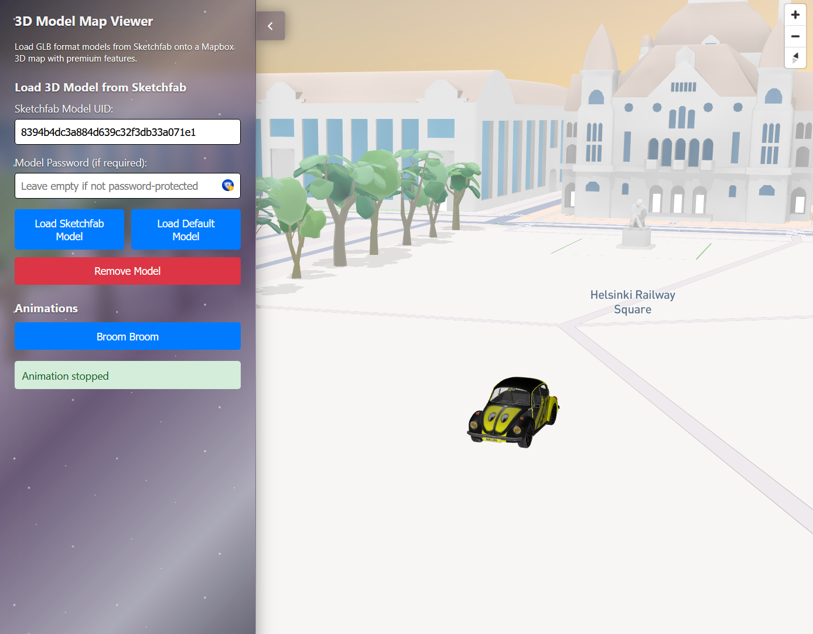

# Sketchfab-Mapbox integration



A React application for loading and displaying 3D models from Sketchfab on a Mapbox 3D map with interactive animations.

## Features

- Load 3D models from Sketchfab API or default model
- Display models on an interactive 3D Mapbox map
- Animated model movements (Broom Broom car animation)
- Model caching for better performance
- Support for both public and private Sketchfab models

## Live Demo

Check out the live demo at [Sketchfab Mapbox Demo](https://sketchfab-api-map.vercel.app/)

## Local setup

1. **Clone the repository and install dependencies:**
   ```bash
   npm install
   ```

2. **Configure environment variables:**
   ```bash
   # Copy the example environment file
   cp .env.example .env
   ```

3. **Get your API tokens:**
   
   **Mapbox API Token (Required):**
   - Go to https://account.mapbox.com/access-tokens/
   - Create a free account if you don't have one
   - Create a new access token
   - Copy the token to your `.env` file as `VITE_MAPBOX_ACCESS_TOKEN`
   
   **Sketchfab API Token (Optional):**
   - Go to https://sketchfab.com/settings/password
   - Generate an API token (only needed for private models)
   - Copy the token to your `.env` file as `VITE_SKETCHFAB_API_TOKEN`

4. **Update your `.env` file:**
   ```env
   VITE_MAPBOX_ACCESS_TOKEN=your_token_here
   VITE_SKETCHFAB_API_TOKEN=your_token_here
   ```

5. **Start the development server:**
   ```bash
   npm run dev
   ```

## Usage

1. **Map Auto-Initialization:** The map will automatically initialize when the page loads if you have a valid Mapbox token in your `.env` file
2. **Load Model:** Either use the default model or enter a Sketchfab model UID
3. **Animate:** Click "Start Broom Broom" to see the car animation


## Environment Variables

The application uses environment variables for API configuration:

- `VITE_MAPBOX_ACCESS_TOKEN` - Your Mapbox API token (required)
- `VITE_SKETCHFAB_API_TOKEN` - Your Sketchfab API token (optional)

Environment variables are automatically loaded from the `.env` file and used as defaults in the UI. You can still override them manually in the interface if needed.

## Technologies Used

- React + Vite
- Mapbox GL JS (3D mapping)
- Three.js (3D rendering)
- Sketchfab API (3D model downloading)
